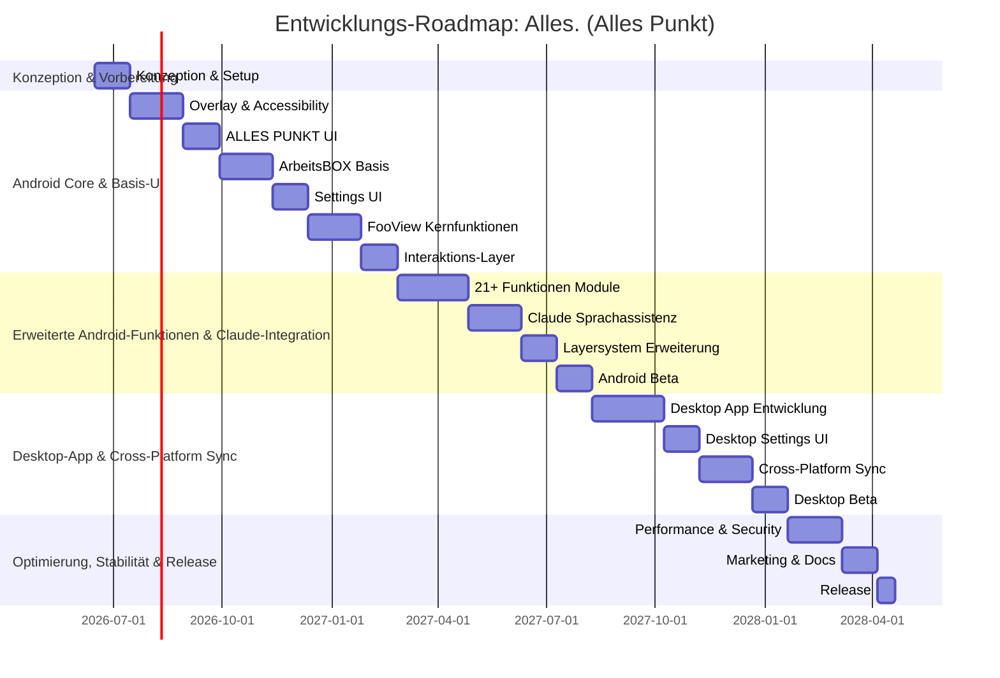
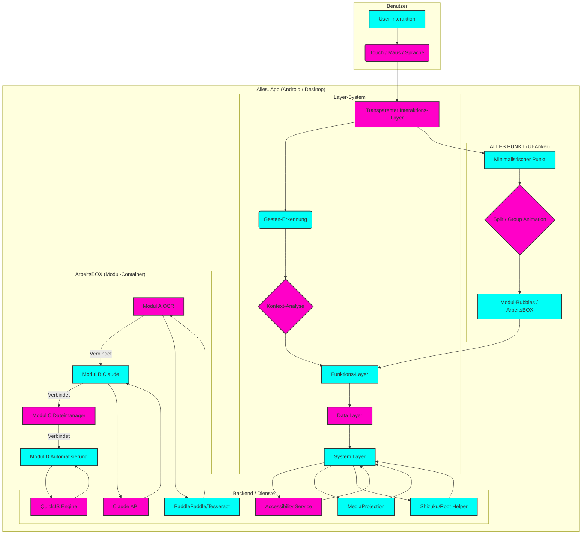
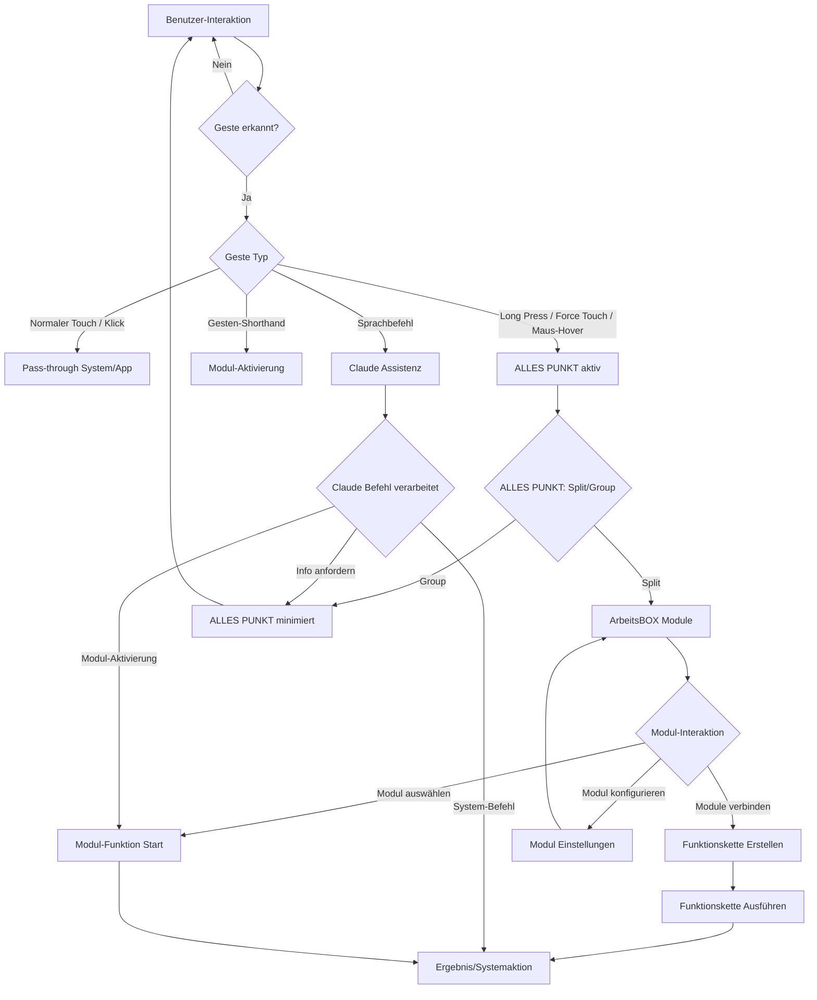

```mermaid
```mermaid
```mermaid
gantt
    dateFormat  YYYY-MM-DD
    title Entwicklungs-Roadmap: Alles. (Alles Punkt)

    section Konzeption & Vorbereitung
    Konzeption & Setup      :a1, 2026-06-15, 30d

    section Android Core & Basis-UI
    Overlay & Accessibility :a2, after a1, 45d
    ALLES PUNKT UI          :a3, after a2, 30d
    ArbeitsBOX Basis        :a4, after a3, 45d
    Settings UI             :a5, after a4, 30d
    FooView Kernfunktionen  :a6, after a5, 45d
    Interaktions-Layer      :a7, after a6, 30d

    section Erweiterte Android-Funktionen & Claude-Integration
    21+ Funktionen Module   :a8, after a7, 60d
    Claude Sprachassistenz  :a9, after a8, 45d
    Layersystem Erweiterung :a10, after a9, 30d
    Android Beta            :a11, after a10, 30d

    section Desktop-App & Cross-Platform Sync
    Desktop App Entwicklung :a12, after a11, 60d
    Desktop Settings UI     :a13, after a12, 30d
    Cross-Platform Sync     :a14, after a13, 45d
    Desktop Beta            :a15, after a14, 30d

    section Optimierung, Stabilität & Release
    Performance & Security  :a16, after a15, 45d
    Marketing & Docs        :a17, after a16, 30d
    Release                 :a18, after a17, 15d
```

## Architektur-Diagramm

```mermaid
graph TD
    subgraph Benutzer
        A[User Interaktion] --> B(Touch / Maus / Sprache)
    end

    subgraph "Alles. App (Android / Desktop)"
        subgraph "ALLES PUNKT (UI-Anker)"
            C[Minimalistischer Punkt] --> D{Split / Group Animation}
            D --> E[Modul-Bubbles / ArbeitsBOX]
        end

        subgraph "Layer-System"
            F[Transparenter Interaktions-Layer] --> G(Gesten-Erkennung)
            G --> H{Kontext-Analyse}
            H --> I[Funktions-Layer]
            I --> J[Data Layer]
            J --> K[System Layer]
        end

        subgraph "ArbeitsBOX (Modul-Container)"
            L[Modul A OCR]
            M[Modul B Claude]
            N[Modul C Dateimanager]
            O[Modul D Automatisierung]
            L -- Verbindet --> M
            M -- Verbindet --> N
            N -- Verbindet --> O
        end

        subgraph "Backend / Dienste"
            P[Accessibility Service] --> K
            Q[MediaProjection] --> K
            R[QuickJS Engine] --> O
            S[PaddlePaddle/Tesseract] --> L
            T[Claude API] --> M
            U[Shizuku/Root Helper] --> K
        end
    end

    B --> F
    F --> C
    E --> I
    K --> P
    K --> Q
    O --> R
    L --> S
    M --> T
    K --> U

    style A fill:#00fff7,stroke:#333,stroke-width:2px
    style B fill:#ff00c8,stroke:#333,stroke-width:2px
    style C fill:#00fff7,stroke:#333,stroke-width:2px
    style D fill:#ff00c8,stroke:#333,stroke-width:2px
    style E fill:#00fff7,stroke:#333,stroke-width:2px
    style F fill:#ff00c8,stroke:#333,stroke-width:2px
    style G fill:#00fff7,stroke:#333,stroke-width:2px
    style H fill:#ff00c8,stroke:#333,stroke-width:2px
    style I fill:#00fff7,stroke:#333,stroke-width:2px
    style J fill:#ff00c8,stroke:#333,stroke-width:2px
    style K fill:#00fff7,stroke:#333,stroke-width:2px
    style L fill:#ff00c8,stroke:#333,stroke-width:2px
    style M fill:#00fff7,stroke:#333,stroke-width:2px
    style N fill:#ff00c8,stroke:#333,stroke-width:2px
    style O fill:#00fff7,stroke:#333,stroke-width:2px
    style P fill:#ff00c8,stroke:#333,stroke-width:2px
    style Q fill:#00fff7,stroke:#333,stroke-width:2px
    style R fill:#ff00c8,stroke:#333,stroke-width:2px
    style S fill:#00fff7,stroke:#333,stroke-width:2px
    style T fill:#ff00c8,stroke:#333,stroke-width:2px
    style U fill:#00fff7,stroke:#333,stroke-width:2px
```

## Interaktions-Flussdiagramm

```mermaid
graph TD
    A[Benutzer-Interaktion] --> B{Geste erkannt?}

    B -- Ja --> C{Geste Typ}
    B -- Nein --> A

    C -- "Normaler Touch / Klick" --> D[Pass-through System/App]
    C -- "Long Press / Force Touch / Maus-Hover" --> E[ALLES PUNKT aktiv]
    C -- "Gesten-Shorthand" --> F[Modul-Aktivierung]
    C -- "Sprachbefehl" --> G[Claude Assistenz]

    E --> H{ALLES PUNKT: Split/Group}
    H -- Split --> I[ArbeitsBOX Module]
    H -- Group --> J[ALLES PUNKT minimiert]

    I --> K{Modul-Interaktion}
    K -- "Modul auswählen" --> L[Modul-Funktion Start]
    K -- "Module verbinden" --> M[Funktionskette Erstellen]
    K -- "Modul konfigurieren" --> N[Modul Einstellungen]

    M --> O[Funktionskette Ausführen]
    O --> P[Ergebnis/Systemaktion]

    G --> Q{Claude Befehl verarbeitet}
    Q -- Modul-Aktivierung --> L
    Q -- System-Befehl --> P
    Q -- Info anfordern --> J

    L --> P
    N --> I
    J --> A
```

